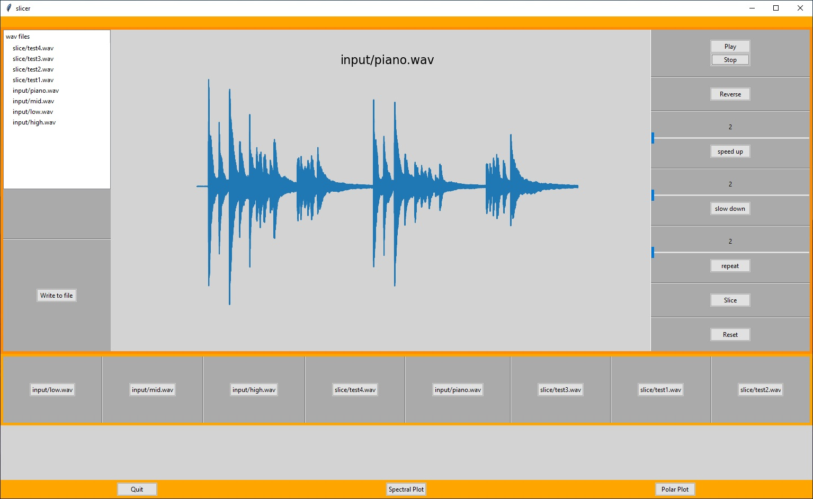

# Slicer
A wave file sampling and slicing project --
prototyped in python and moving to rust.

### Run
    cargo run

### Test
    cargo test

# Prototype

### Run
    pip3 install -r requirements.txt
    python3 slicer.py -d

### Test
    python3 wav.py
    python3 sequencer.py

## Gui
* plot amplitude and spectral graphs
* apply sample modifying features
* write new slice to file

## Euclidian Sequencer
* Play n polyrhitmic sequences
* As the patterns are added the sequencer calculates the minimal number of subdivisions needed to represent all patterns

## Wav/Slice
* Read in a wav file into a non mutable buffer 'samples'
* Apply changes to the buffer
* Play slice
* Save the newly formed slice as a new wav file

### Sample modifying features
    reverse
    speed up
    slow down
    repeat
    reset sample original
